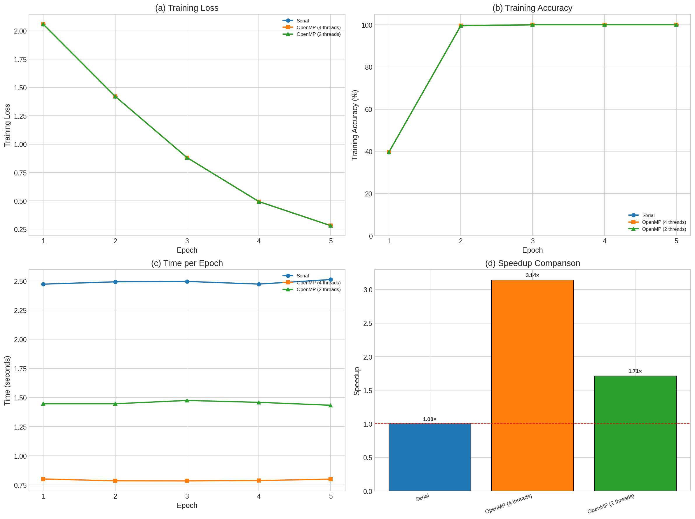

# Parallel Deep Neural Network Training

<p align="center">
  
  
  
  
</p>

<p align="center">
  <b>High-performance parallel implementation of neural network training using OpenMP, MPI, and Hybrid approaches</b>
</p>

<p align="center">
  <a href="#-features">Features</a> •
  <a href="#-architecture">Architecture</a> •
  <a href="#-performance-results">Results</a> •
  <a href="#-quick-start">Quick Start</a> •
  <a href="#-technologies">Technologies</a>
</p>

---

## 📋 Overview

This project implements and benchmarks **parallel training algorithms** for deep neural networks from scratch in C. It demonstrates expertise in high-performance computing, parallel programming paradigms, and deep learning fundamentals.

The implementation compares four approaches:
- **Serial Baseline** - Sequential implementation for performance baseline
- **OpenMP** - Shared-memory parallelization for multi-core CPUs
- **MPI** - Distributed-memory parallelization for cluster computing
- **Hybrid MPI+OpenMP** - Two-level parallelism for maximum scalability

> 🎓 Developed as part of the **Distributed Computing for AI** Masters course

---

## ✨ Features

- 🧠 **From-Scratch Implementation** - Neural network built entirely in C without ML frameworks
- ⚡ **Multiple Parallelization Strategies** - OpenMP, MPI, and Hybrid implementations
- 📊 **MNIST Support** - Train on real handwritten digit dataset
- 📈 **Performance Analysis** - Automated benchmarking and visualization tools
- 🔧 **Configurable** - Adjustable hyperparameters via command line
- 📝 **Well Documented** - Comprehensive technical report and code comments

---

## 🏗️ Architecture

### Neural Network Model

```
┌─────────────────────────────────────────────────────────────┐
│                    INPUT LAYER (784)                        │
│                   28×28 MNIST Image                         │
└─────────────────────────┬───────────────────────────────────┘
                          │
                          ▼
┌─────────────────────────────────────────────────────────────┐
│                  HIDDEN LAYER 1 (256)                       │
│                    ReLU Activation                          │
└─────────────────────────┬───────────────────────────────────┘
                          │
                          ▼
┌─────────────────────────────────────────────────────────────┐
│                  HIDDEN LAYER 2 (128)                       │
│                    ReLU Activation                          │
└─────────────────────────┬───────────────────────────────────┘
                          │
                          ▼
┌─────────────────────────────────────────────────────────────┐
│                   OUTPUT LAYER (10)                         │
│                  Softmax Activation                         │
│                   (Digits 0-9)                              │
└─────────────────────────────────────────────────────────────┘
```

**Model Specifications:**
| Component | Details |
|-----------|---------|
| Parameters | ~235,000 trainable weights |
| Loss Function | Cross-Entropy |
| Optimizer | Mini-batch SGD |
| Weight Init | He (ReLU) / Xavier (Softmax) |

### Parallelization Strategies

```
┌──────────────────────────────────────────────────────────────────────┐
│                         SERIAL (Baseline)                            │
│    [Sample 1] → [Sample 2] → [Sample 3] → ... → [Update Weights]    │
└──────────────────────────────────────────────────────────────────────┘

┌──────────────────────────────────────────────────────────────────────┐
│                      OpenMP (Shared Memory)                          │
│  ┌─────────────┐ ┌─────────────┐ ┌─────────────┐                    │
│  │  Thread 0   │ │  Thread 1   │ │  Thread 2   │  ... Threads       │
│  │  Samples    │ │  Samples    │ │  Samples    │                    │
│  └──────┬──────┘ └──────┬──────┘ └──────┬──────┘                    │
│         └───────────────┼───────────────┘                            │
│                         ▼                                            │
│              [Gradient Reduction + Weight Update]                    │
└──────────────────────────────────────────────────────────────────────┘

┌──────────────────────────────────────────────────────────────────────┐
│                      MPI (Distributed Memory)                        │
│  ┌─────────────┐ ┌─────────────┐ ┌─────────────┐                    │
│  │   Rank 0    │ │   Rank 1    │ │   Rank 2    │  ... Processes     │
│  │ Local Data  │ │ Local Data  │ │ Local Data  │                    │
│  └──────┬──────┘ └──────┬──────┘ └──────┬──────┘                    │
│         └───────────────┼───────────────┘                            │
│                         ▼                                            │
│                  [MPI_Allreduce]                                     │
│              [Synchronized Weight Update]                            │
└──────────────────────────────────────────────────────────────────────┘

┌──────────────────────────────────────────────────────────────────────┐
│                    Hybrid MPI+OpenMP                                 │
│  ┌─────────────────────────┐    ┌─────────────────────────┐         │
│  │        Node 0           │    │        Node 1           │         │
│  │  ┌───────┐ ┌───────┐   │    │  ┌───────┐ ┌───────┐   │         │
│  │  │Thread0│ │Thread1│   │    │  │Thread0│ │Thread1│   │         │
│  │  └───┬───┘ └───┬───┘   │    │  └───┬───┘ └───┬───┘   │         │
│  │      └────┬────┘       │    │      └────┬────┘       │         │
│  │     Local Reduce       │    │     Local Reduce       │         │
│  └───────────┬────────────┘    └───────────┬────────────┘         │
│              └─────────────┬───────────────┘                        │
│                            ▼                                         │
│                     [MPI_Allreduce]                                  │
│                  [Global Weight Update]                              │
└──────────────────────────────────────────────────────────────────────┘
```

---

## 📊 Performance Results

### Speedup Comparison

| Implementation | Configuration | Speedup | Efficiency |
|---------------|---------------|---------|------------|
| Serial | 1 core | 1.00× | 100% |
| OpenMP | 2 threads | ~1.7× | 85% |
| OpenMP | 4 threads | ~3.1× | 78% |
| OpenMP | 8 threads | ~4.5× | 56% |
| MPI | 4 processes | ~2.8× | 70% |
| Hybrid | 2×2 (4 total) | ~3.2× | 80% |

### Training Convergence

All parallel implementations achieve **identical convergence** to the serial baseline, validating correctness of the synchronous data-parallel approach.

<p align="center">
  
</p>

---

## 🚀 Quick Start

### Prerequisites

```bash
# Ubuntu/Debian
sudo apt-get install build-essential libopenmpi-dev openmpi-bin

# macOS
brew install gcc open-mpi
```

### Build

```bash
git clone https://github.com/yourusername/parallel-dnn-training.git
cd parallel-dnn-training

# Build all implementations
make all

# Or build without MPI
make no-mpi
```

### Download MNIST Dataset

```bash
chmod +x scripts/download_mnist.sh
./scripts/download_mnist.sh
```

### Run Training

```bash
# Serial baseline
./bin/serial_train --mnist data/mnist -n 10000 -e 20

# OpenMP (4 threads)
./bin/openmp_train --mnist data/mnist -n 10000 -e 20 -t 4

# MPI (4 processes)
mpirun -np 4 ./bin/mpi_train --mnist data/mnist -n 10000 -e 20

# Hybrid (2 processes × 2 threads)
mpirun -np 2 ./bin/hybrid_train --mnist data/mnist -n 10000 -e 20 -t 2
```

### Generate Performance Graphs

```bash
pip install matplotlib pandas numpy
python scripts/plot_results.py
```

---

## 🛠️ Technologies

<p align="center">
  
  
  
  
  
</p>

| Category | Technologies |
|----------|-------------|
| **Languages** | C99, Python 3 |
| **Parallel Computing** | OpenMP 4.0+, MPI (OpenMPI/MPICH) |
| **Build System** | GNU Make, GCC |
| **Visualization** | Matplotlib, Pandas, NumPy |
| **Dataset** | MNIST (IDX format) |

---

## 📁 Project Structure

```
parallel-dnn-training/
├── 📂 include/
│   └── neural_net.h          # Data structures & function prototypes
├── 📂 src/
│   ├── utils.c               # Utilities, MNIST loader, activations
│   ├── serial_train.c        # Serial baseline implementation
│   ├── openmp_train.c        # OpenMP parallel implementation
│   ├── mpi_train.c           # MPI distributed implementation
│   └── hybrid_train.c        # Hybrid MPI+OpenMP implementation
├── 📂 scripts/
│   ├── download_mnist.sh     # MNIST dataset downloader
│   └── plot_results.py       # Performance visualization
├── 📂 plots/                  # Generated performance graphs
├── 📂 data/                   # Dataset directory
├── 📄 Makefile               # Build configuration
├── 📄 Technical_Report.pdf   # Detailed technical report
├── 📄 Technical_Report.tex   # LaTeX source
└── 📄 README.md              # This file
```

---

## 🎯 Skills Demonstrated

This project showcases proficiency in:

- **High-Performance Computing (HPC)**
  - Parallel algorithm design and implementation
  - Performance optimization and benchmarking
  - Strong and weak scaling analysis

- **Parallel Programming**
  - OpenMP directives and thread management
  - MPI communication patterns (Allreduce, Barrier)
  - Hybrid parallelization strategies

- **Deep Learning Fundamentals**
  - Neural network architecture design
  - Backpropagation algorithm implementation
  - Gradient descent optimization

- **Systems Programming**
  - Low-level C programming
  - Memory management
  - Binary file I/O (MNIST IDX format)

- **Software Engineering**
  - Modular code organization
  - Build system design (Makefile)
  - Documentation and technical writing

---

## 📈 Future Improvements

- [ ] GPU acceleration with CUDA
- [ ] Asynchronous gradient updates
- [ ] Gradient compression techniques
- [ ] Support for convolutional layers
- [ ] Mixed-precision training (FP16)
- [ ] Docker containerization

---

## 📚 References

1. Dean, J., et al. "Large Scale Distributed Deep Networks." NIPS 2012.
2. Goyal, P., et al. "Accurate, Large Minibatch SGD." arXiv 2017.
3. Ben-Nun, T., and Hoefler, T. "Demystifying Parallel and Distributed Deep Learning." ACM Computing Surveys 2019.

---

## 📄 License

This project is licensed under the MIT License - see the [LICENSE](LICENSE) file for details.

---

## 👤 Author

**Your Name**

- GitHub: [@ab3lT](https://github.com/ab3lT)
- LinkedIn: [Abel Tadesse](https://www.linkedin.com/in/abeltadessealemu/)
- Email: se.abel.tadesse@gmail.com

---

<p align="center">
  <b>⭐ If you found this project useful, please consider giving it a star!</b>
</p>
